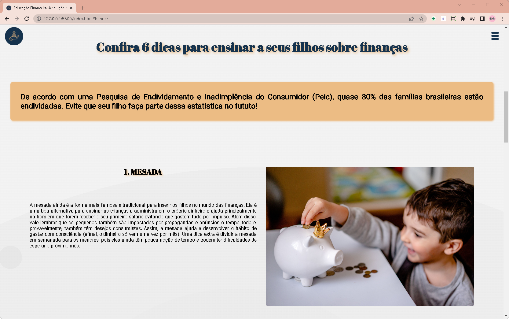
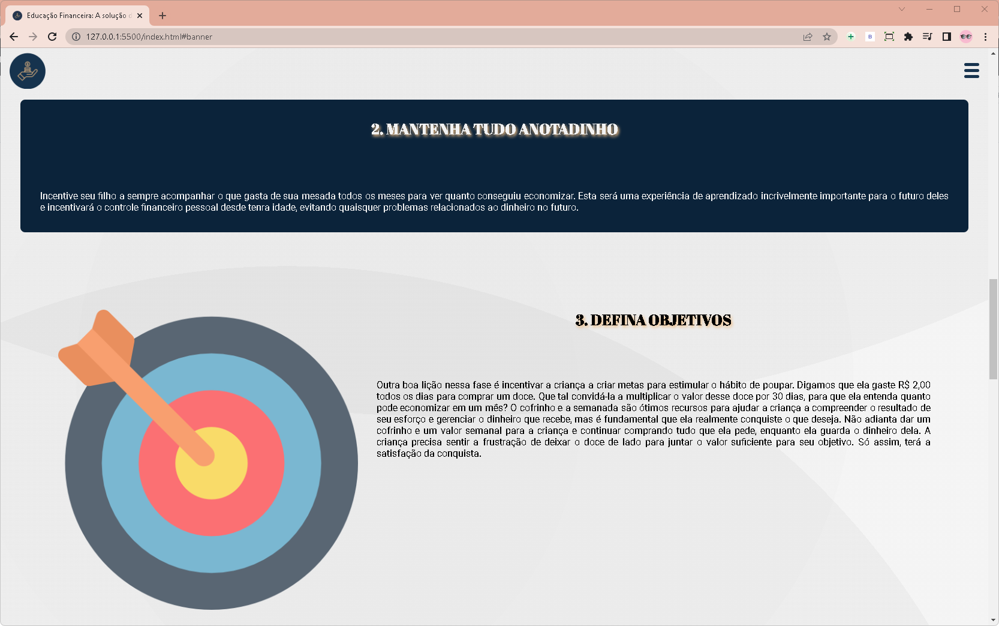
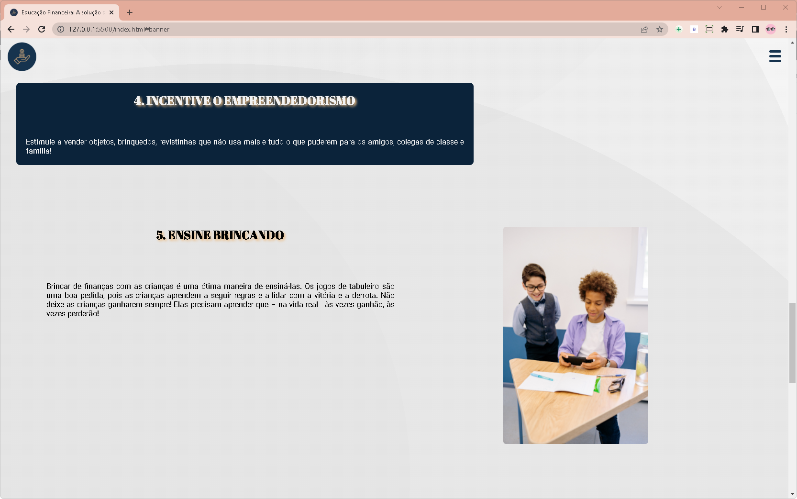
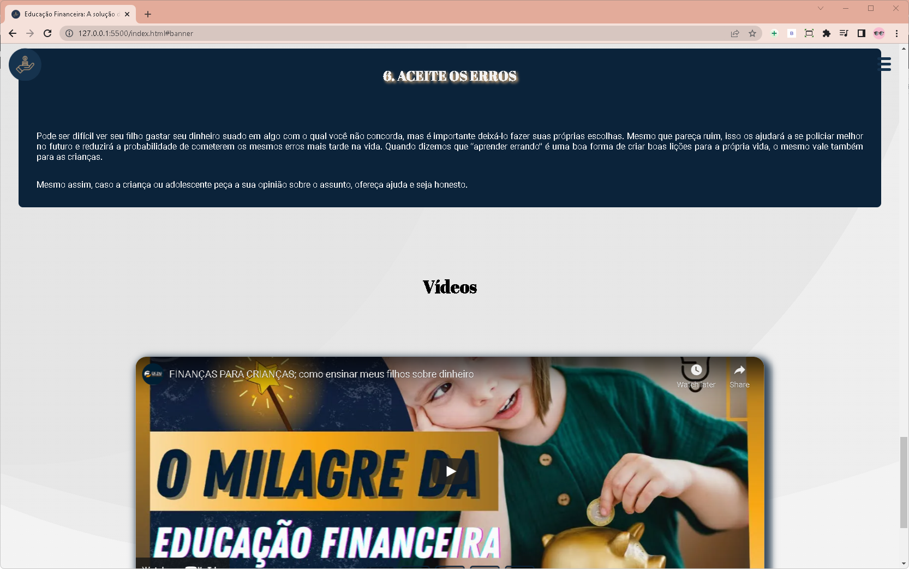

# Hackaton Pré-StartSe
 
Repositório destinado ao projeto do hackaton Pré-StartSe, desenvolvido pelo Grupo 41, com a finalidade de apresentar uma solução para o seguinte problema proposto: "Educação Financeira -  Como podemos ajudar os brasileiros a se organizarem em suas finanças".

## Tema

Educação Financeira -  Como podemos ajudar os brasileiros a se organizarem em suas finanças

## O que foi utilizado?

HTML, CSS e JavaScript

## Imagens

### Home page

### Overview

## Equipe

- Karine Ballardin
- Jasmin
- Marcelo
- Vitor
- Samyra
- Thiago Alves [LinkedIn](https://www.linkedin.com/in/allves/)
